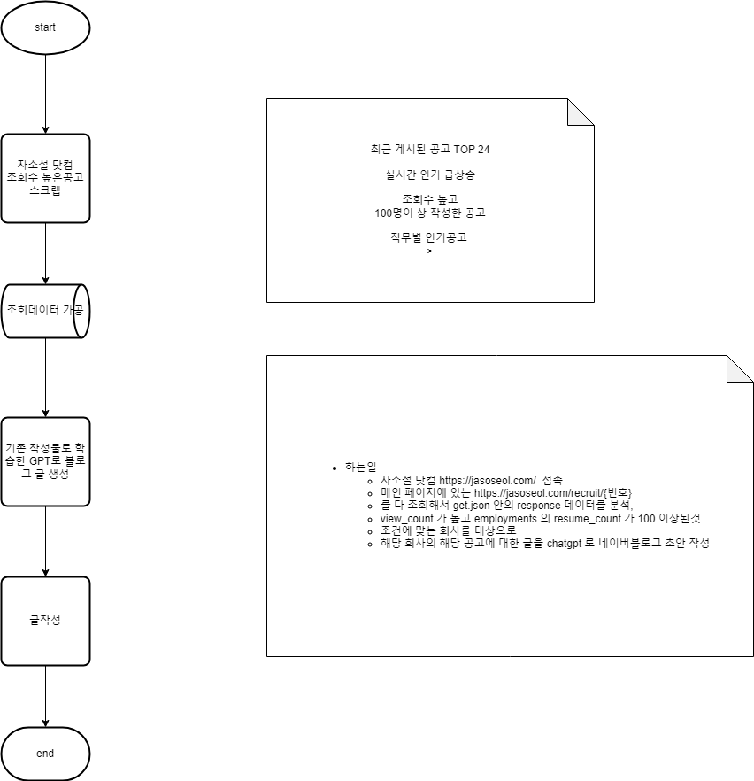

# Web Scrap and post Blog.

### target
    recently posted job TOP 24
    time to time popular job
    top rating post and 100 people write
    job category popular job
### what to do
    web scraping
    post blog

## how to do
connect to https://jasoseol.com/

go mainpage and get src sources(src tag) from https://jasoseol.com/recruit/{number}

every number of recruit number and data from 'get.json' response.

filter to get high view_count and 100 people write resume_count

write blog post from chatgpt data.

## flow-chart

### Prerequisites
- Java 21
- Gradle
- MySQL(H2)
